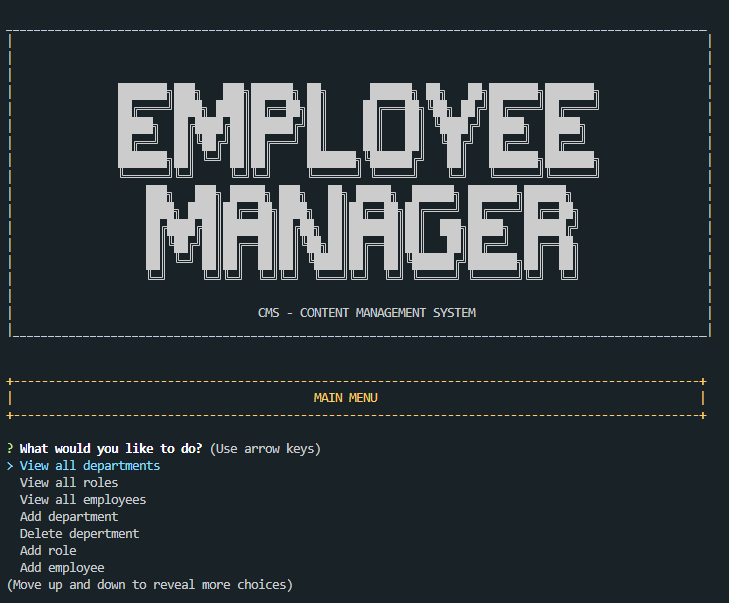
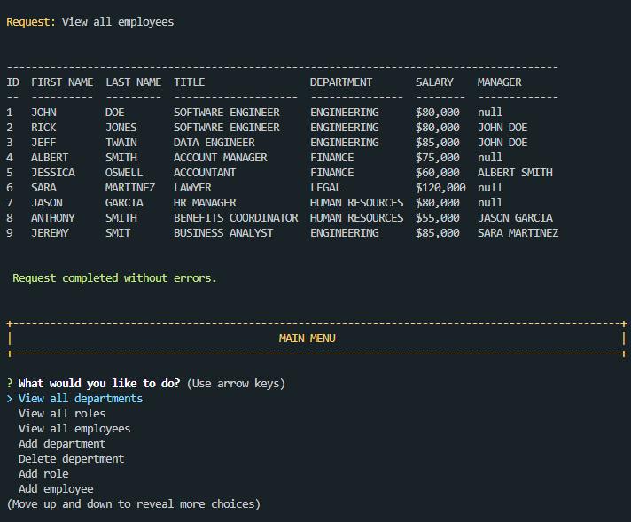

# CMS - Content Management System / Employee Management System

## Description
This app works in node.js and uses inquirer npm to take responses from the user based on which mySQL queries are performed. 

I build this project to help users manage employees, their roles, department, salary and mangers.
My main focus for this app was to gain more experience and hands on practice with mySQL. 

## Table of Contents
- [CMS - Content Management System / Employee Management System](#cms---content-management-system--employee-management-system)
  - [Description](#description)
  - [Table of Contents](#table-of-contents)
  - [Installation](#installation)
      - [Link to GitHub Repo](#link-to-github-repo)
  - [mySQL initial setup](#mysql-initial-setup)
  - [Usage](#usage)
  - [Contributors](#contributors)
  - [License:](#license)
      - [MIT License](#mit-license)
  - [Questions](#questions)
      - [GitHub](#github)
      - [e-mail](#e-mail)
  - [Mock-up](#mock-up)
  - [Walkthrough Video](#walkthrough-video)

## Installation
This project runs in node.js
#### Link to GitHub Repo
[https://github.com/mnyzio/cms](https://github.com/mnyzio/cms)

## mySQL initial setup
For application to be able to run database needs to be created using 'schema.sql' file located in 'db' folder. 
## Usage

Once the application is loaded user will be presented with menu including a list of actions to choose from. 

Below are options available to user in this release:
- View all departments
- View all roles
- View all employees
- Add department
- Delete depertment
- Add role
- Add employee
- Update employee role
- View employees by department
- View employees by manager
- View utilized budget - single department
- View utilized budget - all departments
- View utilized budget - total

## Contributors
Mirek Nyzio
## License:
#### MIT License
## Questions
#### GitHub
[www.github.com/mnyzio](www.github.com/mnyzio)
#### e-mail
[m.nyzio@outlook.com](m.nyzio@outlook.com)

## Mock-up

## Walkthrough Video

[https://youtu.be/-eWn-L_i4hQ](https://youtu.be/-eWn-L_i4hQ)
